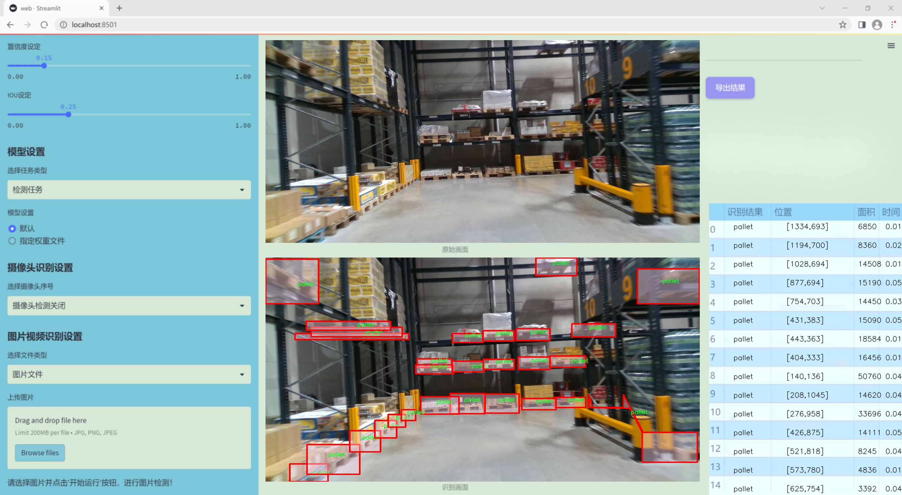
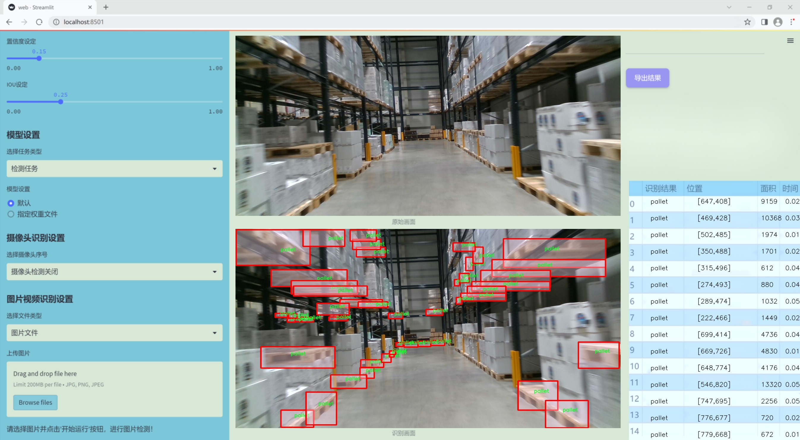
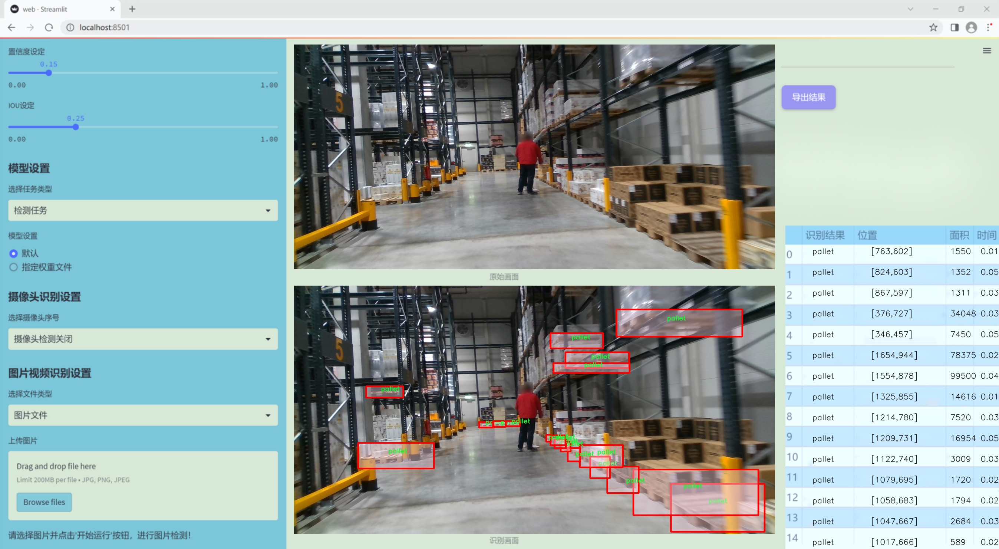
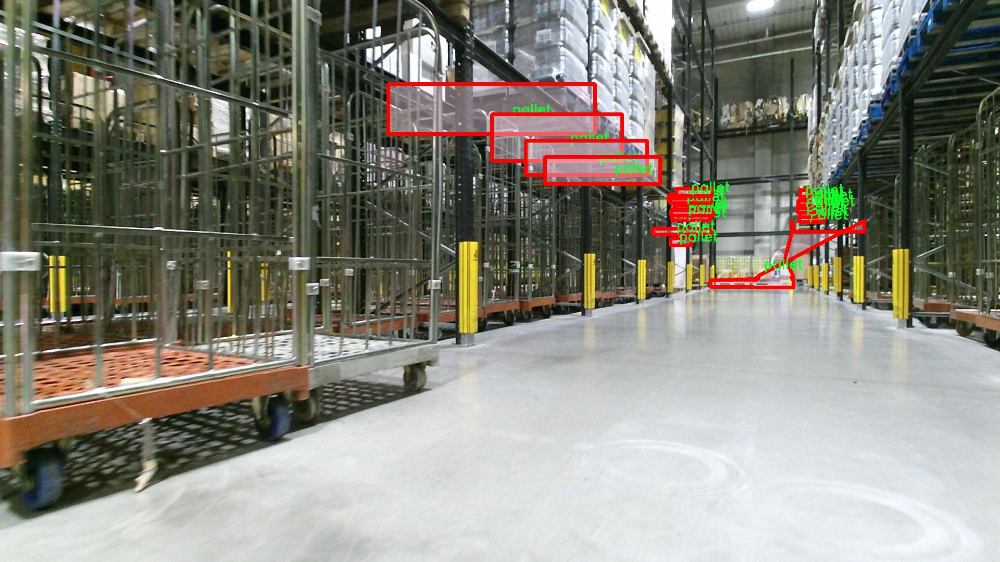
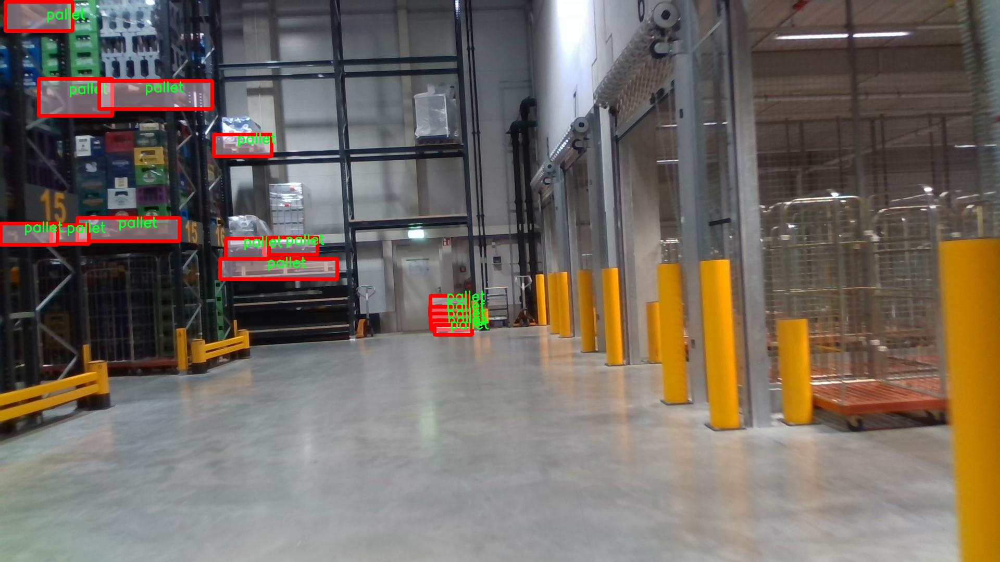
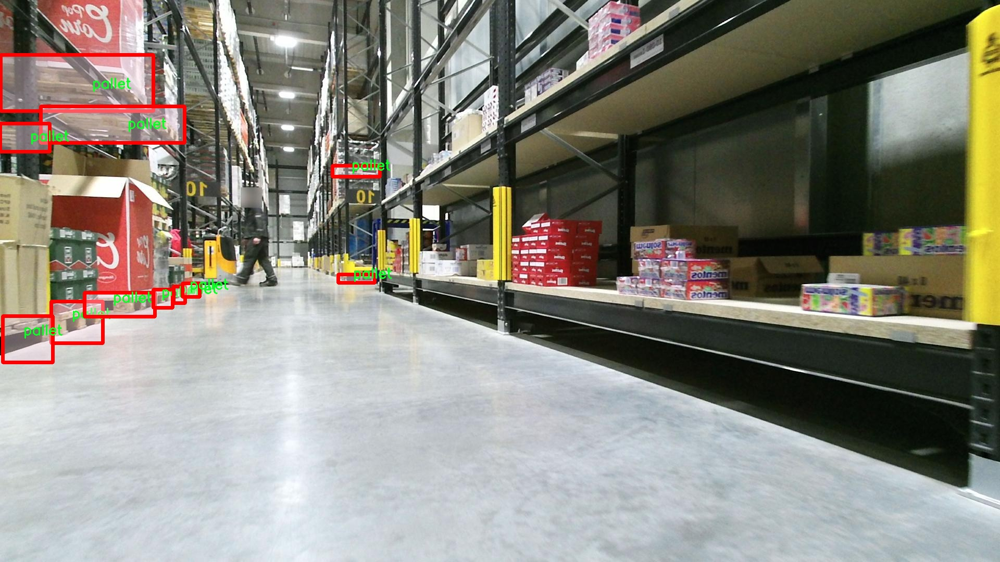
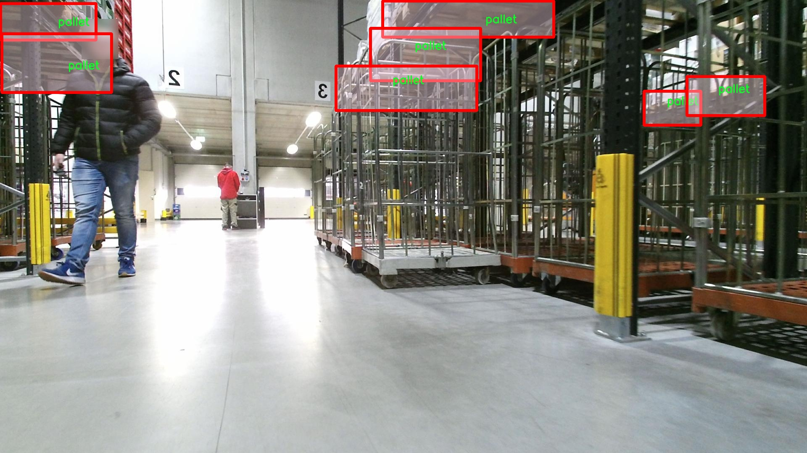
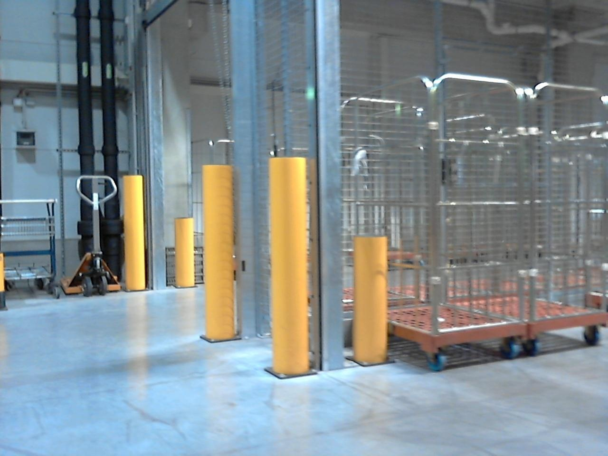

# 改进yolo11-bifpn-SDI等200+全套创新点大全：叉车与托盘检测系统源码＆数据集全套

### 1.图片效果展示







##### 项目来源 **[人工智能促进会 2024.10.30](https://kdocs.cn/l/cszuIiCKVNis)**

注意：由于项目一直在更新迭代，上面“1.图片效果展示”和“2.视频效果展示”展示的系统图片或者视频可能为老版本，新版本在老版本的基础上升级如下：（实际效果以升级的新版本为准）

  （1）适配了YOLOV11的“目标检测”模型和“实例分割”模型，通过加载相应的权重（.pt）文件即可自适应加载模型。

  （2）支持“图片识别”、“视频识别”、“摄像头实时识别”三种识别模式。

  （3）支持“图片识别”、“视频识别”、“摄像头实时识别”三种识别结果保存导出，解决手动导出（容易卡顿出现爆内存）存在的问题，识别完自动保存结果并导出到tempDir中。

  （4）支持Web前端系统中的标题、背景图等自定义修改。

  另外本项目提供训练的数据集和训练教程,暂不提供权重文件（best.pt）,需要您按照教程进行训练后实现图片演示和Web前端界面演示的效果。

### 2.视频效果展示

[2.1 视频效果展示](https://www.bilibili.com/video/BV1VJSqYbEoc/)

### 3.背景

研究背景与意义

随着物流与仓储行业的快速发展，叉车与托盘的高效管理成为提升作业效率和降低运营成本的重要环节。叉车作为仓储作业中的主要设备，其使用频率和重要性不言而喻。同时，托盘作为货物存储和运输的基本单元，合理的管理与调度也对整体物流效率产生深远影响。然而，传统的叉车与托盘管理方式往往依赖人工监控，效率低下且易出错，无法满足现代物流对实时性和准确性的高要求。因此，基于计算机视觉的自动检测系统应运而生，成为提升叉车与托盘管理效率的有效手段。

在这一背景下，YOLO（You Only Look Once）系列目标检测算法因其高效性和实时性而受到广泛关注。YOLOv11作为该系列的最新版本，具备更强的特征提取能力和更快的处理速度，适合在复杂的仓储环境中进行叉车与托盘的实时检测。通过对叉车、托盘、托盘车和货架等类别的识别与定位，能够实现对仓储作业的智能化管理，提升作业安全性和效率。

本研究将基于改进的YOLOv11模型，构建一个高效的叉车与托盘检测系统。数据集“forklift-1”包含1200张图像，涵盖叉车、托盘、托盘车和货架等两个主要类别，为模型的训练和测试提供了丰富的样本。通过对该数据集的深入分析与处理，结合YOLOv11的先进特性，期望能够实现高精度的目标检测，为物流行业的智能化转型提供有力支持。最终，本研究不仅将推动叉车与托盘管理的自动化进程，也为相关领域的研究提供新的思路和方法，具有重要的理论价值和实际应用意义。

### 4.数据集信息展示

##### 4.1 本项目数据集详细数据（类别数＆类别名）

nc: 1
names: ['pallet']


该项目为【图像分割】数据集，请在【训练教程和Web端加载模型教程（第三步）】这一步的时候按照【图像分割】部分的教程来训练

##### 4.2 本项目数据集信息介绍

本项目数据集信息介绍

本项目所使用的数据集名为“forklift-1”，旨在为改进YOLOv11的叉车与托盘检测系统提供高质量的训练数据。该数据集专注于叉车在工业环境中与托盘的交互，尤其是在仓储和物流场景下的应用。数据集的类别数量为1，具体类别为“pallet”，即托盘。这一类别的选择反映了项目的核心目标，即提升叉车在处理托盘时的检测精度和效率。

“forklift-1”数据集包含了丰富的图像样本，涵盖了不同角度、光照条件和背景环境下的托盘图像。这些样本不仅展示了托盘的多样性，还考虑了叉车在实际操作中可能遇到的各种情况。数据集中的图像经过精心标注，确保每个托盘的边界框准确无误，为模型的训练提供了可靠的基础。通过使用这一数据集，YOLOv11模型能够学习到托盘的特征和在叉车操作中的重要性，从而在实际应用中实现更高的检测准确率。

此外，数据集的构建过程遵循了严格的标准，确保了数据的多样性和代表性。这不仅有助于模型在训练过程中获得更全面的特征学习，还能提高其在不同环境下的泛化能力。随着叉车与托盘检测技术的不断进步，基于“forklift-1”数据集的YOLOv11改进系统将为工业自动化和智能物流的发展提供强有力的支持，推动相关领域的技术革新与应用落地。通过这一数据集的有效利用，项目期望能够实现叉车与托盘检测的智能化和高效化，为未来的工业应用奠定坚实的基础。











### 5.全套项目环境部署视频教程（零基础手把手教学）

[5.1 所需软件PyCharm和Anaconda安装教程（第一步）](https://www.bilibili.com/video/BV1BoC1YCEKi/?spm_id_from=333.999.0.0&vd_source=bc9aec86d164b67a7004b996143742dc)


[5.2 安装Python虚拟环境创建和依赖库安装视频教程（第二步）](https://www.bilibili.com/video/BV1ZoC1YCEBw?spm_id_from=333.788.videopod.sections&vd_source=bc9aec86d164b67a7004b996143742dc)

### 6.改进YOLOv11训练教程和Web_UI前端加载模型教程（零基础手把手教学）

[6.1 改进YOLOv11训练教程和Web_UI前端加载模型教程（第三步）](https://www.bilibili.com/video/BV1BoC1YCEhR?spm_id_from=333.788.videopod.sections&vd_source=bc9aec86d164b67a7004b996143742dc)


按照上面的训练视频教程链接加载项目提供的数据集，运行train.py即可开始训练



     Epoch   gpu_mem       box       obj       cls    labels  img_size
     1/200     20.8G   0.01576   0.01955  0.007536        22      1280: 100%|██████████| 849/849 [14:42<00:00,  1.04s/it]
               Class     Images     Labels          P          R     mAP@.5 mAP@.5:.95: 100%|██████████| 213/213 [01:14<00:00,  2.87it/s]
                 all       3395      17314      0.994      0.957      0.0957      0.0843

     Epoch   gpu_mem       box       obj       cls    labels  img_size
     2/200     20.8G   0.01578   0.01923  0.007006        22      1280: 100%|██████████| 849/849 [14:44<00:00,  1.04s/it]
               Class     Images     Labels          P          R     mAP@.5 mAP@.5:.95: 100%|██████████| 213/213 [01:12<00:00,  2.95it/s]
                 all       3395      17314      0.996      0.956      0.0957      0.0845

     Epoch   gpu_mem       box       obj       cls    labels  img_size
     3/200     20.8G   0.01561    0.0191  0.006895        27      1280: 100%|██████████| 849/849 [10:56<00:00,  1.29it/s]
               Class     Images     Labels          P          R     mAP@.5 mAP@.5:.95: 100%|███████   | 187/213 [00:52<00:00,  4.04it/s]
                 all       3395      17314      0.996      0.957      0.0957      0.0845


###### [项目数据集下载链接](https://kdocs.cn/l/cszuIiCKVNis)

### 7.原始YOLOv11算法讲解

YOLOv11是一种由Ultralytics公司开发的最新一代目标检测模型，以其增强的特征提取能力和更高的效率在计算机视觉领域引人注目。该模型在架构上进行了关键升级，通过更新主干和颈部结构，显著提高了对复杂视觉场景的理解和处理精度。YOLOv11不仅在目标检测上表现出色，还支持实例分割、图像分类、姿态估计和定向目标检测（OBB）等任务，展示出其多功能性。

与其前身YOLOv8相比，YOLOv11在设计上实现了深度和宽度的改变，同时引入了几个创新机制。其中，C3k2机制是对YOLOv8中的C2f的改进，提升了浅层特征的处理能力；C2PSA机制则进一步优化了特征图的处理流程。解耦头的创新设计，通过增加两个深度卷积（DWConv），提高了模型对细节的感知能力和分类准确性。

在性能上，YOLOv11m模型在COCO数据集上的平均精度（mAP）提高，并减少了22%的参数量，确保了在运算效率上的突破。该模型可以部署在多种平台上，包括边缘设备、云平台以及支持NVIDIA GPU的系统，彰显出卓越的灵活性和适应性。总体而言，YOLOv11通过一系列的创新突破，对目标检测领域产生了深远的影响，并为未来的开发提供了新的研究方向。


****文档**** ： _ _https://docs.ultralytics.com/models/yolo11/__

****代码链接**** ： _ _https://github.com/ultralytics/ultralytics__

******Performance Metrics******


​ ** **关键特性****

****◆**** ** **增强的特征提取能力**** ：YOLO11采用了改进的主干和颈部架构，增强了 ** **特征提取****
能力，能够实现更精确的目标检测和复杂任务的执行。

****◆**** ** **优化的效率和速度****
：YOLO11引入了精细化的架构设计和优化的训练流程，提供更快的处理速度，并在准确性和性能之间保持最佳平衡。

****◆**** ** **参数更少、精度更高****
：通过模型设计的改进，YOLO11m在COCO数据集上实现了更高的平均精度（mAP），同时使用的参数比YOLOv8m少22%，使其在计算上更加高效，而不牺牲准确性。

****◆**** ** **跨环境的适应性**** ：YOLO11可以无缝部署在各种环境中，包括边缘设备、云平台和支持NVIDIA
GPU的系统，确保最大的灵活性。

****◆**** ** **支持广泛任务****
：无论是目标检测、实例分割、图像分类、姿态估计还是定向目标检测（OBB），YOLO11都旨在应对一系列计算机视觉挑战。

****支持的任务和模式****


​YOLO11建立在YOLOv8中引入的多功能模型范围之上，为各种计算机视觉任务提供增强的支持:


​该表提供了YOLO11模型变体的概述，展示了它们在特定任务中的适用性以及与Inference、Validation、Training和Export等操作模式的兼容性。从实时检测到复杂的分割任务
，这种灵活性使YOLO11适用于计算机视觉的广泛应用。

##### yolov11的创新

■ yolov8 VS yolov11

YOLOv5，YOLOv8和YOLOv11均是ultralytics公司的作品，ultralytics出品必属精品。


​ **具体创新点** ：

**① 深度（depth）和宽度 （width）**

YOLOv8和YOLOv11是基本上完全不同。

**② C3k2机制**

C3k2有参数为c3k，其中在网络的浅层c3k设置为False。C3k2就相当于YOLOv8中的C2f。


​ **③ C2PSA机制**

下图为C2PSA机制的原理图。


​ **④ 解耦头**

解耦头中的分类检测头增加了两个 **DWConv** 。


▲Conv

    
    
    def autopad(k, p=None, d=1):  # kernel, padding, dilation
    
        """Pad to 'same' shape outputs."""
    
        if d > 1:
    
            k = d * (k - 1) + 1 if isinstance(k, int) else [d * (x - 1) + 1 for x in k]  # actual kernel-size
    
        if p is None:
    
            p = k // 2 if isinstance(k, int) else [x // 2 for x in k]  # auto-pad
    
    return p
    
    
    class Conv(nn.Module):
    
        """Standard convolution with args(ch_in, ch_out, kernel, stride, padding, groups, dilation, activation)."""
    
    
        default_act = nn.SiLU()  # default activation
    
    
        def __init__(self, c1, c2, k=1, s=1, p=None, g=1, d=1, act=True):
    
            """Initialize Conv layer with given arguments including activation."""
    
            super().__init__()
    
            self.conv = nn.Conv2d(c1, c2, k, s, autopad(k, p, d), groups=g, dilation=d, bias=False)
    
            self.bn = nn.BatchNorm2d(c2)
    
            self.act = self.default_act if act is True else act if isinstance(act, nn.Module) else nn.Identity()
    
    
        def forward(self, x):
    
            """Apply convolution, batch normalization and activation to input tensor."""
    
            return self.act(self.bn(self.conv(x)))
    
    
        def forward_fuse(self, x):
    
            """Perform transposed convolution of 2D data."""
    
            return self.act(self.conv(x))

▲Conv2d

    
    
    torch.nn.Conv2d(in_channels, out_channels, kernel_size, stride=1, padding=0, dilation=1, groups=1, bias=True, padding_mode='zeros')

▲DWConv

DWConv ** **代表 Depthwise Convolution（深度卷积）****
，是一种在卷积神经网络中常用的高效卷积操作。它主要用于减少计算复杂度和参数量。

    
    
    class DWConv(Conv):
    
        """Depth-wise convolution."""
    
    
        def __init__(self, c1, c2, k=1, s=1, d=1, act=True):  # ch_in, ch_out, kernel, stride, dilation, activation
    
            """Initialize Depth-wise convolution with given parameters."""
    
            super().__init__(c1, c2, k, s, g=math.gcd(c1, c2), d=d, act=act)


### 8.200+种全套改进YOLOV11创新点原理讲解

#### 8.1 200+种全套改进YOLOV11创新点原理讲解大全

由于篇幅限制，每个创新点的具体原理讲解就不全部展开，具体见下列网址中的改进模块对应项目的技术原理博客网址【Blog】（创新点均为模块化搭建，原理适配YOLOv5~YOLOv11等各种版本）

[改进模块技术原理博客【Blog】网址链接](https://gitee.com/qunmasj/good)


#### 8.2 精选部分改进YOLOV11创新点原理讲解

###### 这里节选部分改进创新点展开原理讲解(完整的改进原理见上图和[改进模块技术原理博客链接](https://gitee.com/qunmasj/good)【如果此小节的图加载失败可以通过CSDN或者Github搜索该博客的标题访问原始博客，原始博客图片显示正常】


### D-LKA Attention简介
自2010年代中期以来，卷积神经网络（CNNs）已成为许多计算机视觉应用的首选技术。它们能够从原始数据中自动提取复杂的特征表示，无需手动进行特征工程，这引起了医学图像分析社区的极大兴趣。许多成功的CNN架构，如U-Net、全卷积网络、DeepLab或SegCaps（分割胶囊），已经被开发出来。这些架构在语义分割任务中取得了巨大成功，先前的最新方法已经被超越。

在计算机视觉研究中，不同尺度下的目标识别是一个关键问题。在CNN中，可检测目标的大小与相应网络层的感受野尺寸密切相关。如果一个目标扩展到超出这个感受野的边界，这可能会导致欠分割结果。相反，与目标实际大小相比使用过大的感受野可能会限制识别，因为背景信息可能会对预测产生不必要的影响。

解决这个问题的一个有希望的方法涉及在并行使用具有不同尺寸的多个Kernel，类似于Inception块的机制。然而，由于参数和计算要求的指数增长，将Kernel大小增加以容纳更大的目标在实践中受到限制。因此，出现了各种策略，包括金字塔池化技术和不同尺度的扩张卷积，以捕获多尺度的上下文信息。

另一个直观的概念涉及将多尺度图像金字塔或它们的相关特征表示直接纳入网络架构。然而，这种方法存在挑战，特别是在管理训练和推理时间方面的可行性方面存在挑战。在这个背景下，使用编码器-解码器网络，如U-Net，已被证明是有利的。这样的网络在较浅的层中编码外观和位置，而在更深的层中，通过神经元的更广泛的感受野捕获更高的语义信息和上下文信息。

一些方法将来自不同层的特征组合在一起，或者预测来自不同尺寸的层的特征以使用多尺度的信息。此外，出现了从不同尺度的层中预测特征的方法，有效地实现了跨多个尺度的见解整合。然而，大多数编码器-解码器结构面临一个挑战：它们经常无法在不同尺度之间保持一致的特征，并主要使用最后一个解码器层生成分割结果。

语义分割是一项任务，涉及根据预定义的标签集为图像中的每个像素预测语义类别。这项任务要求提取高级特征同时保留初始的空间分辨率。CNNs非常适合捕获局部细节和低级信息，尽管以忽略全局上下文为代价。视觉Transformer（ViT）架构已经成为解决处理全局信息的视觉任务的关键，包括语义分割，取得了显著的成功。

ViT的基础是注意力机制，它有助于在整个输入序列上聚合信息。这种能力使网络能够合并远程的上下文提示，超越了CNN的有限感受野尺寸。然而，这种策略通常会限制ViT有效建模局部信息的能力。这种局限可能会妨碍它们检测局部纹理的能力，这对于各种诊断和预测任务至关重要。这种缺乏局部表示可以归因于ViT模型处理图像的特定方式。

ViT模型将图像分成一系列Patch，并使用自注意力机制来模拟它们之间的依赖关系。这种方法可能不如CNN模型中的卷积操作对感受野内提取局部特征有效。ViT和CNN模型之间的这种图像处理方法的差异可能解释了CNN模型在局部特征提取方面表现出色的原因。

近年来，已经开发出创新性方法来解决Transformer模型内部局部纹理不足的问题。其中一种方法是通过互补方法将CNN和ViT特征结合起来，以结合它们的优势并减轻局部表示的不足。TransUNet是这种方法的早期示例，它在CNN的瓶颈中集成了Transformer层，以模拟局部和全局依赖关系。HiFormer提出了一种解决方案，将Swin Transformer模块和基于CNN的编码器结合起来，生成两个多尺度特征表示，通过Double-Level Fusion模块集成。UNETR使用基于Transformer的编码器和CNN解码器进行3D医学图像分割。CoTr和TransBTS通过Transformer在低分辨率阶段增强分割性能，将CNN编码器和解码器连接在一起。

增强局部特征表示的另一种策略是重新设计纯Transformer模型内部的自注意力机制。在这方面，Swin-Unet在U形结构中集成了一个具有线性计算复杂性的Swin Transformer块作为多尺度 Backbone 。MISSFormer采用高效Transformer来解决视觉Transformer中的参数问题，通过在输入块上进行不可逆的降采样操作。D-Former引入了一个纯Transformer的管道，具有双重注意模块，以分段的方式捕获细粒度的局部注意和与多元单元的交互。然而，仍然存在一些特定的限制，包括计算效率低下，如TransUNet模型所示，对CNN Backbone 的严重依赖，如HiFormer所观察到的，以及对多尺度信息的忽略。

此外，目前的分割架构通常采用逐层处理3D输入 volumetric 的方法，无意中忽视了相邻切片之间的潜在相关性。这一疏忽限制了对 volumetric 信息的全面利用，因此损害了定位精度和上下文集成。此外，必须认识到，医学领域的病变通常在形状上发生变形。因此，用于医学图像分析的任何学习算法都必须具备捕捉和理解这些变形的能力。与此同时，该算法应保持计算效率，以便处理3D volumetric数据。

为了解决上述提到的挑战，作者提出了一个解决方案，即可变形大卷积核注意力模块（Deformable LKA module），它是作者网络设计的基本构建模块。这个模块明确设计成在有效处理上下文信息的同时保留局部描述符。作者的架构在这两个方面的平衡增强了实现精确语义分割的能力。

值得注意的是，参考该博客引入了一种基于数据的感受野的动态适应，不同于传统卷积操作中的固定滤波器Mask。这种自适应方法使作者能够克服与静态方法相关的固有限制。这种创新方法还扩展到了D-LKA Net架构的2D和3D版本的开发。

在3D模型的情况下，D-LKA机制被量身定制以适应3D环境，从而实现在不同 volumetric 切片之间无缝信息交互。最后，作者的贡献通过其计算效率得到进一步强调。作者通过仅依靠D-LKA概念的设计来实现这一点，在各种分割基准上取得了显著的性能，确立了作者的方法作为一种新的SOTA方法。

在本节中，作者首先概述方法论。首先，作者回顾了由Guo等人引入的大卷积核注意力（Large Kernel Attention，LKA）的概念。然后，作者介绍了作者对可变形LKA模块的创新探索。在此基础上，作者介绍了用于分割任务的2D和3D网络架构。

大卷积核提供了与自注意力机制类似的感受野。可以通过使用深度卷积、深度可扩展卷积和卷积来构建大卷积核，从而减少了参数和计算量。构建输入维度为和通道数的卷积核的深度卷积和深度可扩展卷积的卷积核大小的方程如下：


具有卷积核大小和膨胀率。参数数量和浮点运算（FLOPs）的计算如下：


FLOPs的数量与输入图像的大小成线性增长。参数的数量随通道数和卷积核大小的增加而呈二次增长。然而，由于它们通常都很小，因此它们不是限制因素。

为了最小化对于固定卷积核大小K的参数数量，可以将方程3对于膨胀率的导数设定为零：


例如，当卷积核大小为时，结果是。将这些公式扩展到3D情况是直接的。对于大小为和通道数C的输入，3D情况下参数数量和FLOPs 的方程如下：


具有卷积核大小和膨胀。


利用大卷积核进行医学图像分割的概念通过引入可变形卷积得以扩展。可变形卷积可以通过整数偏移自由调整采样网格以进行自由变形。额外的卷积层从特征图中学习出变形，从而创建一个偏移场。基于特征本身学习变形会导致自适应卷积核。这种灵活的卷积核形状可以提高病变或器官变形的表示，从而增强了目标边界的定义。

负责计算偏移的卷积层遵循其相应卷积层的卷积核大小和膨胀。双线性插值用于计算不在图像网格上的偏移的像素值。如图2所示，D-LKA模块可以表示为：


其中输入特征由表示，。表示为注意力图，其中每个值表示相应特征的相对重要性。运算符  表示逐元素乘法运算。值得注意的是，LKA不同于传统的注意力方法，它不需要额外的规范化函数，如或。这些规范化函数往往忽视高频信息，从而降低了基于自注意力的方法的性能。

在该方法的2D版本中，卷积层被可变形卷积所替代，因为可变形卷积能够改善对具有不规则形状和大小的目标的捕捉能力。这些目标在医学图像数据中常常出现，因此这种增强尤为重要。

然而，将可变形LKA的概念扩展到3D领域会带来一定的挑战。主要的约束来自于需要用于生成偏移的额外卷积层。与2D情况不同，由于输入和输出通道的性质，这一层无法以深度可分的方式执行。在3D环境中，输入通道对应于特征，而输出通道扩展到，其中是卷积核的大小。大卷积核的复杂性导致沿第3D的通道数扩展，导致参数和FLOPs大幅增加。因此，针对3D情况采用了另一种替代方法。在现有的LKA框架中，深度卷积之后引入了一个单独的可变形卷积层。这种战略性的设计调整旨在减轻扩展到3D领域所带来的挑战。


2D网络的架构如图1所示。第一变种使用MaxViT作为编码器组件，用于高效特征提取，而第二变种则结合可变形LKA层进行更精细、卓越的分割。

在更正式的描述中，编码器生成4个分层输出表示。首先，卷积干扰将输入图像的维度减小到。随后，通过4个MaxViT块的4个阶段进行特征提取，每个阶段后跟随降采样层。随着过程进展到解码器，实施了4个阶段的D-LKA层，每个阶段包含2个D-LKA块。然后，应用Patch扩展层以实现分辨率上采样，同时减小通道维度。最后，线性层负责生成最终的输出。

2D D-LKA块的结构包括LayerNorm、可变形LKA和多层感知器（MLP）。积分残差连接确保了有效的特征传播，即使在更深层也是如此。这个安排可以用数学方式表示为：


其中输入特征，层归一化LN，可变形LKA注意力，深度卷积，线性层和GeLU激活函数。

3D网络架构如图1所示，采用编码器-解码器设计进行分层结构化。首先，一个Patch嵌入层将输入图像的维度从（）减小到（）。在编码器中，采用了3个D-LKA阶段的序列，每个阶段包含3个D-LKA块。在每个阶段之后，通过降采样步骤将空间分辨率减半，同时将通道维度加倍。中央瓶颈包括另一组2个D-LKA块。解码器结构与编码器相对称。

为了将特征分辨率加倍，同时减少通道数，使用转置卷积。每个解码器阶段都使用3个D-LKA块来促进远距离特征依赖性。最终的分割输出由一个卷积层产生，后面跟随一个卷积层以匹配特定类别的通道要求。

为了建立输入图像和分割输出之间的直接连接，使用卷积形成了一个跳跃连接。额外的跳跃连接根据简单的加法对来自其他阶段的特征进行融合。最终的分割图是通过和卷积层的组合产生的。

3D D-LKA块包括层归一化，后跟D-LKA注意力，应用了残差连接的部分。随后的部分采用了一个卷积层，后面跟随一个卷积层，两者都伴随着残差连接。这个整个过程可以总结如下：


带有输入特征 、层归一化 、可变形 LKA 、卷积层 和输出特征 的公式。是指一个前馈网络，包括2个卷积层和激活函数。

表7显示了普通卷积和构建卷积的参数数量比较。尽管标准卷积的参数数量在通道数较多时急剧增加，但分解卷积的参数总体较低，并且增长速度不那么快。

与分解卷积相比，可变形分解卷积增加了大量参数，但仍然明显小于标准卷积。可变形卷积的主要参数是由偏移网络创建的。在这里，作者假设可变形深度卷积的Kernel大小为（5,5），可变形深度空洞卷积的Kernel大小为（7,7）。这导致了21×21大小的大Kernel的最佳参数数量。更高效地生成偏移量的方法将大大减少参数数量。


值得注意的是，引入可变形LKA确实会增加模型的参数数量和每秒的浮点运算次数（FLOPS）。然而，重要的是强调，这增加的计算负载不会影响作者模型的整体推理速度。

相反，对于Batch-size > 1，作者甚至观察到推理时间的减少，如图7所示。例如，基于作者的广泛实验，作者观察到对于Batch-size为16，具有可变形卷积和没有可变形卷积的推理时间分别为8.01毫秒和17.38毫秒。作者认为这是由于在2D中对可变形卷积的高效实现所致。为了测量时间，使用了大小为（）的随机输入。在GPU热身周期50次迭代之后，网络被推断了1000次。测量是在NVIDIA RTX 3090 GPU上进行的。


为了充分利用性能与参数之间的权衡关系，作者在图8中可视化了在Synapse 2D数据集上报告的DSC和HD性能以及基于参数数量的内存消耗。D-LKA Net引入了相当多的参数，约为101M。这比性能第二好的方法ScaleFormer使用的111.6M参数要少。

与更轻量级的DAEFormer模型相比，作者实现了更好的性能，这证明了参数增加的合理性。大多数参数来自于MaxViT编码器；因此，将编码器替换为更高效的编码器可以减少模型参数。值得注意的是，在此可视化中，作者最初将HD和内存值都归一化到[0, 100]范围内。随后，作者将它们从100缩小，以增强更高值的表示。


### 9.系统功能展示

图9.1.系统支持检测结果表格显示

  图9.2.系统支持置信度和IOU阈值手动调节

  图9.3.系统支持自定义加载权重文件best.pt(需要你通过步骤5中训练获得)

  图9.4.系统支持摄像头实时识别

  图9.5.系统支持图片识别

  图9.6.系统支持视频识别

  图9.7.系统支持识别结果文件自动保存

  图9.8.系统支持Excel导出检测结果数据


### 10. YOLOv11核心改进源码讲解

#### 10.1 metaformer.py

以下是代码中最核心的部分，并附上详细的中文注释：

```python
import torch
import torch.nn as nn
import torch.nn.functional as F

class MF_Attention(nn.Module):
    """
    自注意力机制，源自Transformer。
    """
    def __init__(self, dim, head_dim=32, num_heads=None, qkv_bias=False,
                 attn_drop=0., proj_drop=0., proj_bias=False):
        super().__init__()

        self.head_dim = head_dim  # 每个头的维度
        self.scale = head_dim ** -0.5  # 缩放因子

        # 计算头的数量
        self.num_heads = num_heads if num_heads else dim // head_dim
        if self.num_heads == 0:
            self.num_heads = 1
        
        self.attention_dim = self.num_heads * self.head_dim  # 注意力维度

        # 定义线性层用于计算Q、K、V
        self.qkv = nn.Linear(dim, self.attention_dim * 3, bias=qkv_bias)
        self.attn_drop = nn.Dropout(attn_drop)  # 注意力的dropout
        self.proj = nn.Linear(self.attention_dim, dim, bias=proj_bias)  # 投影层
        self.proj_drop = nn.Dropout(proj_drop)  # 投影后的dropout

    def forward(self, x):
        B, H, W, C = x.shape  # 获取输入的批量大小、高度、宽度和通道数
        N = H * W  # 计算总的token数量
        # 计算Q、K、V
        qkv = self.qkv(x).reshape(B, N, 3, self.num_heads, self.head_dim).permute(2, 0, 3, 1, 4)
        q, k, v = qkv.unbind(0)  # 分离Q、K、V

        # 计算注意力分数
        attn = (q @ k.transpose(-2, -1)) * self.scale
        attn = attn.softmax(dim=-1)  # 归一化
        attn = self.attn_drop(attn)  # 应用dropout

        # 计算输出
        x = (attn @ v).transpose(1, 2).reshape(B, H, W, self.attention_dim)
        x = self.proj(x)  # 投影到原始维度
        x = self.proj_drop(x)  # 应用dropout
        return x


class Mlp(nn.Module):
    """
    MLP（多层感知机），用于MetaFormer模型。
    """
    def __init__(self, dim, mlp_ratio=4, out_features=None, act_layer=nn.ReLU, drop=0., bias=False):
        super().__init__()
        in_features = dim
        out_features = out_features or in_features
        hidden_features = int(mlp_ratio * in_features)  # 隐藏层特征数
        drop_probs = (drop, drop)  # dropout概率

        # 定义两层线性层和激活函数
        self.fc1 = nn.Linear(in_features, hidden_features, bias=bias)
        self.act = act_layer()  # 激活函数
        self.drop1 = nn.Dropout(drop_probs[0])  # 第一个dropout
        self.fc2 = nn.Linear(hidden_features, out_features, bias=bias)
        self.drop2 = nn.Dropout(drop_probs[1])  # 第二个dropout

    def forward(self, x):
        x = self.fc1(x)  # 第一层线性变换
        x = self.act(x)  # 激活
        x = self.drop1(x)  # 应用dropout
        x = self.fc2(x)  # 第二层线性变换
        x = self.drop2(x)  # 应用dropout
        return x


class MetaFormerBlock(nn.Module):
    """
    MetaFormer块的实现。
    """
    def __init__(self, dim,
                 token_mixer=nn.Identity, mlp=Mlp,
                 norm_layer=nn.LayerNorm,
                 drop=0., drop_path=0.,
                 layer_scale_init_value=None, res_scale_init_value=None):

        super().__init__()

        self.norm1 = norm_layer(dim)  # 第一层归一化
        self.token_mixer = token_mixer(dim=dim, drop=drop)  # token混合器
        self.drop_path1 = nn.Dropout(drop_path) if drop_path > 0. else nn.Identity()  # 路径dropout
        self.layer_scale1 = nn.Parameter(torch.ones(dim)) if layer_scale_init_value else nn.Identity()  # 层缩放
        self.res_scale1 = nn.Parameter(torch.ones(dim)) if res_scale_init_value else nn.Identity()  # 残差缩放

        self.norm2 = norm_layer(dim)  # 第二层归一化
        self.mlp = mlp(dim=dim, drop=drop)  # MLP
        self.drop_path2 = nn.Dropout(drop_path) if drop_path > 0. else nn.Identity()  # 路径dropout
        self.layer_scale2 = nn.Parameter(torch.ones(dim)) if layer_scale_init_value else nn.Identity()  # 层缩放
        self.res_scale2 = nn.Parameter(torch.ones(dim)) if res_scale_init_value else nn.Identity()  # 残差缩放

    def forward(self, x):
        x = x.permute(0, 2, 3, 1)  # 调整维度顺序
        # 第一部分：归一化 -> token混合 -> 残差连接
        x = self.res_scale1(x) + \
            self.layer_scale1(
                self.drop_path1(
                    self.token_mixer(self.norm1(x))
                )
            )
        # 第二部分：归一化 -> MLP -> 残差连接
        x = self.res_scale2(x) + \
            self.layer_scale2(
                self.drop_path2(
                    self.mlp(self.norm2(x))
                )
            )
        return x.permute(0, 3, 1, 2)  # 恢复维度顺序
```

### 代码核心部分说明：
1. **MF_Attention**：实现了自注意力机制，能够对输入进行加权和聚合，适用于处理序列数据。
2. **Mlp**：实现了多层感知机结构，包含线性层和激活函数，适用于特征的非线性变换。
3. **MetaFormerBlock**：将自注意力和MLP结合在一起，形成一个完整的MetaFormer块，能够处理输入数据并进行特征提取。

这些核心组件构成了MetaFormer模型的基础，能够有效地处理图像和序列数据。

这个 `metaformer.py` 文件实现了一些用于构建 MetaFormer 模型的基础组件，主要包括不同类型的激活函数、注意力机制、卷积层、归一化层以及 MLP（多层感知机）等。这些组件可以被组合在一起，形成更复杂的网络结构。

首先，文件中定义了一个 `Scale` 类，用于对输入向量进行元素级别的缩放。它使用可训练的参数来实现缩放，初始化时可以设置初始值和是否可训练。

接下来是 `SquaredReLU` 和 `StarReLU` 两个激活函数的实现。`SquaredReLU` 是一种修改过的 ReLU 激活函数，它在应用 ReLU 后对结果进行平方操作。`StarReLU` 则在 ReLU 的基础上增加了可学习的缩放和偏置参数，形式为 \( s \cdot \text{ReLU}(x)^2 + b \)。

`MF_Attention` 类实现了自注意力机制，类似于 Transformer 中的自注意力。它通过线性变换生成查询、键和值，然后计算注意力权重，并对值进行加权求和。这个过程包括了 dropout 操作以防止过拟合。

`RandomMixing` 类实现了一种随机混合操作，使用一个随机生成的矩阵对输入进行变换。这个矩阵在初始化时通过 softmax 函数归一化，确保其行和为 1。

`LayerNormGeneral` 类是一个通用的层归一化实现，可以根据输入的形状和需求调整参数的形状和归一化的维度。它支持可选的缩放和偏置参数，并在前向传播中计算均值和方差进行归一化。

`LayerNormWithoutBias` 类是一个优化版本的层归一化，直接利用 PyTorch 的 `F.layer_norm` 函数，去掉了偏置项以提高计算效率。

`SepConv` 类实现了分离卷积，采用了 MobileNetV2 中的反向分离卷积结构。它通过逐点卷积和深度卷积的组合来减少参数量和计算量。

`Pooling` 类实现了一种池化操作，类似于 PoolFormer 中的池化方法，通过平均池化来对输入进行下采样，并返回池化结果与原始输入的差值。

`Mlp` 类实现了一个多层感知机，包含两个线性层和激活函数，并在两层之间添加了 dropout 操作，以增强模型的泛化能力。

`ConvolutionalGLU` 类实现了一种卷积门控线性单元（GLU），它结合了卷积操作和门控机制，能够更好地捕捉输入特征。

`MetaFormerBlock` 和 `MetaFormerCGLUBlock` 类分别实现了 MetaFormer 的基本模块，前者使用标准的 MLP，后者使用卷积 GLU。它们都包含了归一化、混合和残差连接的结构，以增强模型的表达能力和稳定性。

整体来看，这个文件为构建 MetaFormer 模型提供了多种基础组件，能够灵活组合以适应不同的任务需求。

#### 10.2 CSwomTramsformer.py

以下是经过简化并添加详细中文注释的核心代码部分：

```python
import torch
import torch.nn as nn
import numpy as np

class Mlp(nn.Module):
    """多层感知机（MLP）模块"""
    def __init__(self, in_features, hidden_features=None, out_features=None, act_layer=nn.GELU, drop=0.):
        super().__init__()
        out_features = out_features or in_features  # 输出特征数
        hidden_features = hidden_features or in_features  # 隐藏层特征数
        self.fc1 = nn.Linear(in_features, hidden_features)  # 第一层线性变换
        self.act = act_layer()  # 激活函数
        self.fc2 = nn.Linear(hidden_features, out_features)  # 第二层线性变换
        self.drop = nn.Dropout(drop)  # Dropout层

    def forward(self, x):
        """前向传播"""
        x = self.fc1(x)  # 线性变换
        x = self.act(x)  # 激活
        x = self.drop(x)  # Dropout
        x = self.fc2(x)  # 线性变换
        x = self.drop(x)  # Dropout
        return x

class CSWinBlock(nn.Module):
    """CSWin Transformer的基本块"""
    def __init__(self, dim, num_heads, mlp_ratio=4., drop=0., attn_drop=0.):
        super().__init__()
        self.dim = dim  # 输入特征维度
        self.num_heads = num_heads  # 注意力头数
        self.mlp_ratio = mlp_ratio  # MLP的扩展比例
        self.qkv = nn.Linear(dim, dim * 3)  # 线性变换用于生成Q、K、V
        self.norm1 = nn.LayerNorm(dim)  # 第一层归一化
        self.attn = LePEAttention(dim, num_heads=num_heads, attn_drop=attn_drop)  # 注意力机制
        self.mlp = Mlp(in_features=dim, hidden_features=int(dim * mlp_ratio), out_features=dim)  # MLP
        self.norm2 = nn.LayerNorm(dim)  # 第二层归一化

    def forward(self, x):
        """前向传播"""
        x = self.norm1(x)  # 归一化
        qkv = self.qkv(x).reshape(x.shape[0], -1, 3, self.dim).permute(2, 0, 1, 3)  # 生成Q、K、V
        x = self.attn(qkv)  # 注意力计算
        x = x + self.norm2(x)  # 加上归一化后的输入
        x = x + self.mlp(x)  # 加上MLP的输出
        return x

class CSWinTransformer(nn.Module):
    """CSWin Transformer模型"""
    def __init__(self, img_size=640, in_chans=3, num_classes=1000, embed_dim=96, depth=[2,2,6,2], num_heads=12):
        super().__init__()
        self.num_classes = num_classes  # 类别数
        self.embed_dim = embed_dim  # 嵌入维度

        # 输入层，使用卷积层进行特征提取
        self.stage1_conv_embed = nn.Sequential(
            nn.Conv2d(in_chans, embed_dim, kernel_size=7, stride=4, padding=2),
            nn.LayerNorm(embed_dim)
        )

        # 定义多个CSWinBlock
        self.stage1 = nn.ModuleList([
            CSWinBlock(dim=embed_dim, num_heads=num_heads) for _ in range(depth[0])
        ])
        # 其他阶段可以继续添加...

    def forward(self, x):
        """前向传播"""
        x = self.stage1_conv_embed(x)  # 特征提取
        for blk in self.stage1:
            x = blk(x)  # 通过每个CSWinBlock
        return x

# 示例：创建CSWinTransformer模型并进行前向传播
if __name__ == '__main__':
    inputs = torch.randn((1, 3, 640, 640))  # 随机输入
    model = CSWinTransformer()  # 创建模型
    res = model(inputs)  # 前向传播
    print(res.size())  # 输出结果的尺寸
```

### 代码说明：
1. **Mlp类**：实现了一个简单的多层感知机，包含两个线性层和一个激活函数，支持Dropout。
2. **CSWinBlock类**：实现了CSWin Transformer的基本块，包含注意力机制和MLP模块。
3. **CSWinTransformer类**：构建了整个CSWin Transformer模型，包含输入层和多个CSWinBlock的堆叠。
4. **前向传播**：在`__main__`部分，创建了一个模型实例并对随机输入进行前向传播，输出结果的尺寸。

这个程序文件实现了一个名为CSWin Transformer的视觉变换器模型，主要用于图像分类任务。该模型由多个模块组成，包括多层感知机（Mlp）、局部增强注意力（LePEAttention）、CSWin块（CSWinBlock）、合并块（Merge_Block）以及主模型类（CSWinTransformer）。以下是对代码的详细说明。

首先，程序导入了必要的库，包括PyTorch及其相关模块、timm库中的一些工具函数、以及einops库用于张量重排。程序中定义了一些常量和模型名称，便于后续使用。

Mlp类定义了一个多层感知机结构，包含两个线性层和一个激活函数（默认为GELU），并在每个线性层后面添加了Dropout层以防止过拟合。该类的forward方法实现了前向传播。

LePEAttention类实现了局部增强注意力机制。它根据输入的维度、分辨率、头数等参数初始化多个组件，并定义了im2cswin和get_lepe方法，用于将输入张量转换为窗口形式和获取局部增强特征。forward方法则实现了注意力计算，包括对查询、键、值的处理，以及最终的输出。

CSWinBlock类是CSWin Transformer的基本构建块，包含注意力层和多层感知机。根据输入的分辨率和头数，它会选择不同的注意力层，并通过DropPath实现随机深度。forward方法中，输入首先经过归一化，然后通过线性层生成查询、键和值，接着经过注意力机制处理，最后通过MLP和残差连接得到输出。

img2windows和windows2img函数用于将图像从标准格式转换为窗口格式，便于后续的注意力计算和重构。

Merge_Block类用于在不同阶段之间进行特征合并，通常使用卷积层来减少特征图的尺寸，并通过归一化层进行处理。

CSWinTransformer类是整个模型的核心，负责定义模型的结构，包括输入的卷积嵌入、多个CSWinBlock的堆叠、合并块的使用等。它的构造函数接受多个参数，如图像大小、补丁大小、输入通道数、类别数、嵌入维度、深度、头数等，并根据这些参数构建模型。forward_features方法负责特征提取，而forward方法则调用该方法并返回最终的特征。

此外，程序还定义了一些辅助函数，如_conv_filter用于转换权重，update_weight用于更新模型权重，以及四个不同规模的模型构造函数（CSWin_tiny、CSWin_small、CSWin_base、CSWin_large），这些函数可以根据需要加载预训练权重。

最后，在主程序部分，生成了随机输入，并分别实例化不同规模的模型进行前向传播，输出每个模型的特征图大小。这部分代码主要用于测试模型的构建和运行是否正常。

总体来说，这个程序实现了一个高效的视觉变换器模型，结合了局部增强注意力机制和多层感知机，适用于图像分类等任务。

#### 10.3 rmt.py

以下是经过简化和注释的核心代码部分：

```python
import torch
import torch.nn as nn
import torch.nn.functional as F

class DWConv2d(nn.Module):
    """ 深度可分离卷积类 """
    def __init__(self, dim, kernel_size, stride, padding):
        super().__init__()
        # 使用分组卷积实现深度可分离卷积
        self.conv = nn.Conv2d(dim, dim, kernel_size, stride, padding, groups=dim)

    def forward(self, x: torch.Tensor):
        '''
        x: 输入张量，形状为 (b, h, w, c)
        '''
        x = x.permute(0, 3, 1, 2)  # 转换为 (b, c, h, w)
        x = self.conv(x)  # 进行卷积操作
        x = x.permute(0, 2, 3, 1)  # 转换回 (b, h, w, c)
        return x

class FeedForwardNetwork(nn.Module):
    """ 前馈神经网络类 """
    def __init__(self, embed_dim, ffn_dim, activation_fn=F.gelu, dropout=0.0):
        super().__init__()
        self.fc1 = nn.Linear(embed_dim, ffn_dim)  # 第一层线性变换
        self.fc2 = nn.Linear(ffn_dim, embed_dim)  # 第二层线性变换
        self.dropout = nn.Dropout(dropout)  # Dropout层
        self.activation_fn = activation_fn  # 激活函数

    def forward(self, x: torch.Tensor):
        '''
        x: 输入张量，形状为 (b, h, w, c)
        '''
        x = self.fc1(x)  # 线性变换
        x = self.activation_fn(x)  # 激活函数
        x = self.dropout(x)  # Dropout
        x = self.fc2(x)  # 线性变换
        return x

class RetBlock(nn.Module):
    """ 保留块类，包含注意力机制和前馈网络 """
    def __init__(self, embed_dim: int, num_heads: int, ffn_dim: int):
        super().__init__()
        self.attention = MaSA(embed_dim, num_heads)  # 注意力机制
        self.ffn = FeedForwardNetwork(embed_dim, ffn_dim)  # 前馈网络
        self.norm1 = nn.LayerNorm(embed_dim)  # 层归一化
        self.norm2 = nn.LayerNorm(embed_dim)  # 层归一化

    def forward(self, x: torch.Tensor):
        '''
        x: 输入张量，形状为 (b, h, w, c)
        '''
        x = x + self.attention(self.norm1(x))  # 添加注意力机制的输出
        x = x + self.ffn(self.norm2(x))  # 添加前馈网络的输出
        return x

class VisRetNet(nn.Module):
    """ 视觉恢复网络类 """
    def __init__(self, in_chans=3, num_classes=1000, embed_dims=[96, 192, 384, 768], depths=[2, 2, 6, 2], num_heads=[3, 6, 12, 24]):
        super().__init__()
        self.patch_embed = PatchEmbed(in_chans=in_chans, embed_dim=embed_dims[0])  # 图像到补丁的嵌入
        self.layers = nn.ModuleList()  # 存储各层

        for i in range(len(depths)):
            layer = BasicLayer(embed_dim=embed_dims[i], depth=depths[i], num_heads=num_heads[i])  # 创建基本层
            self.layers.append(layer)  # 添加到层列表

    def forward(self, x):
        '''
        x: 输入张量，形状为 (b, c, h, w)
        '''
        x = self.patch_embed(x)  # 嵌入补丁
        for layer in self.layers:
            x = layer(x)  # 通过每一层
        return x

# 创建一个简单的模型实例
def RMT_T():
    model = VisRetNet(
        embed_dims=[64, 128, 256, 512],
        depths=[2, 2, 8, 2],
        num_heads=[4, 4, 8, 16]
    )
    return model

if __name__ == '__main__':
    model = RMT_T()  # 创建模型
    inputs = torch.randn((1, 3, 640, 640))  # 随机输入
    res = model(inputs)  # 前向传播
    print(res.size())  # 输出结果的形状
```

### 代码说明：
1. **DWConv2d**: 实现深度可分离卷积，适用于处理特征图。
2. **FeedForwardNetwork**: 前馈神经网络，由两层线性变换和激活函数组成，带有Dropout。
3. **RetBlock**: 包含注意力机制和前馈网络的模块，使用层归一化。
4. **VisRetNet**: 视觉恢复网络，负责将输入图像嵌入到补丁，并通过多个基本层进行处理。
5. **RMT_T**: 创建一个小型的视觉恢复网络实例，方便测试和使用。

通过这些核心部分的组合，可以构建一个用于图像处理的深度学习模型。

这个程序文件`rmt.py`实现了一个基于视觉变换器（Vision Transformer）的网络架构，名为`VisRetNet`，并定义了一些相关的模块和功能。该网络主要用于图像处理任务，具有多种配置选项以适应不同的需求。

首先，文件中导入了必要的库，包括`torch`和`torch.nn`，以及一些其他的模块和函数。接着，定义了一些基本的组件，如`DWConv2d`（深度可分离卷积）、`RelPos2d`（二维相对位置编码）、`MaSAd`和`MaSA`（多头自注意力机制的变体）等。这些组件是构建视觉变换器的基础。

`DWConv2d`类实现了深度可分离卷积，它通过将输入张量的维度进行转换，执行卷积操作并再转换回原来的维度。`RelPos2d`类用于生成相对位置编码，支持二维和一维的衰减掩码生成，帮助模型在处理图像时保持空间信息。

`MaSAd`和`MaSA`类实现了多头自注意力机制，其中`MaSAd`支持块级的递归处理，而`MaSA`则处理整个输入。这些类通过线性变换生成查询、键和值，并计算注意力权重，最终输出加权后的值。

`FeedForwardNetwork`类实现了前馈神经网络，包括两个线性层和激活函数。`RetBlock`类则是一个包含自注意力和前馈网络的基本块，支持层归一化和残差连接。

`PatchMerging`类用于将输入特征图进行下采样，`BasicLayer`类则构建了一个基本的变换器层，包含多个`RetBlock`和可选的下采样层。

`LayerNorm2d`和`PatchEmbed`类分别实现了二维层归一化和图像到补丁的嵌入转换。`VisRetNet`类是整个网络的主体，负责将输入图像分割成补丁并通过多个层进行处理，最终输出特征。

最后，文件定义了几个函数（`RMT_T`、`RMT_S`、`RMT_B`、`RMT_L`），用于创建不同配置的`VisRetNet`模型。每个函数都设置了不同的嵌入维度、深度、头数等参数，以适应不同的任务需求。

在`__main__`部分，创建了一个`RMT_T`模型实例，并生成一个随机输入张量进行测试，打印输出特征的尺寸。这表明该模型可以正常运行并处理输入数据。

总体来说，这个程序文件实现了一个灵活且可扩展的视觉变换器架构，适用于各种图像处理任务。

#### 10.4 afpn.py

以下是代码中最核心的部分，并添加了详细的中文注释：

```python
import torch
import torch.nn as nn
import torch.nn.functional as F
from ..modules.conv import Conv  # 导入自定义卷积模块

class BasicBlock(nn.Module):
    """基本块，包含两个卷积层和残差连接"""
    def __init__(self, filter_in, filter_out):
        super(BasicBlock, self).__init__()
        # 第一个卷积层，使用3x3卷积
        self.conv1 = Conv(filter_in, filter_out, 3)
        # 第二个卷积层，使用3x3卷积，不使用激活函数
        self.conv2 = Conv(filter_out, filter_out, 3, act=False)

    def forward(self, x):
        residual = x  # 保存输入以用于残差连接
        out = self.conv1(x)  # 通过第一个卷积层
        out = self.conv2(out)  # 通过第二个卷积层
        out += residual  # 添加残差
        return self.conv1.act(out)  # 通过激活函数并返回结果

class Upsample(nn.Module):
    """上采样模块，使用1x1卷积和双线性插值"""
    def __init__(self, in_channels, out_channels, scale_factor=2):
        super(Upsample, self).__init__()
        self.upsample = nn.Sequential(
            Conv(in_channels, out_channels, 1),  # 1x1卷积
            nn.Upsample(scale_factor=scale_factor, mode='bilinear')  # 双线性插值上采样
        )

    def forward(self, x):
        return self.upsample(x)  # 返回上采样结果

class Downsample_x2(nn.Module):
    """2倍下采样模块"""
    def __init__(self, in_channels, out_channels):
        super(Downsample_x2, self).__init__()
        self.downsample = Conv(in_channels, out_channels, 2, 2, 0)  # 2x2卷积下采样

    def forward(self, x):
        return self.downsample(x)  # 返回下采样结果

class ASFF_2(nn.Module):
    """自适应特征融合模块，处理两个输入特征图"""
    def __init__(self, inter_dim=512):
        super(ASFF_2, self).__init__()
        self.inter_dim = inter_dim
        compress_c = 8  # 压缩通道数

        # 为每个输入特征图创建权重卷积
        self.weight_level_1 = Conv(self.inter_dim, compress_c, 1)
        self.weight_level_2 = Conv(self.inter_dim, compress_c, 1)
        self.weight_levels = nn.Conv2d(compress_c * 2, 2, kernel_size=1)  # 计算融合权重
        self.conv = Conv(self.inter_dim, self.inter_dim, 3)  # 最后的卷积层

    def forward(self, input1, input2):
        # 计算每个输入的权重
        level_1_weight_v = self.weight_level_1(input1)
        level_2_weight_v = self.weight_level_2(input2)

        # 合并权重并计算最终权重
        levels_weight_v = torch.cat((level_1_weight_v, level_2_weight_v), 1)
        levels_weight = self.weight_levels(levels_weight_v)
        levels_weight = F.softmax(levels_weight, dim=1)  # 归一化权重

        # 融合特征图
        fused_out_reduced = input1 * levels_weight[:, 0:1, :, :] + \
                            input2 * levels_weight[:, 1:2, :, :]

        out = self.conv(fused_out_reduced)  # 通过卷积层
        return out  # 返回融合后的特征图

class BlockBody_P345(nn.Module):
    """处理三个尺度的特征图的模块"""
    def __init__(self, channels=[64, 128, 256, 512]):
        super(BlockBody_P345, self).__init__()

        # 定义不同尺度的卷积块
        self.blocks_scalezero1 = nn.Sequential(Conv(channels[0], channels[0], 1))
        self.blocks_scaleone1 = nn.Sequential(Conv(channels[1], channels[1], 1))
        self.blocks_scaletwo1 = nn.Sequential(Conv(channels[2], channels[2], 1))

        # 定义下采样和上采样模块
        self.downsample_scalezero1_2 = Downsample_x2(channels[0], channels[1])
        self.upsample_scaleone1_2 = Upsample(channels[1], channels[0], scale_factor=2)

        # 定义自适应特征融合模块
        self.asff_scalezero1 = ASFF_2(inter_dim=channels[0])
        self.asff_scaleone1 = ASFF_2(inter_dim=channels[1])

        # 定义多个基本块
        self.blocks_scalezero2 = nn.Sequential(
            BasicBlock(channels[0], channels[0]),
            BasicBlock(channels[0], channels[0]),
            BasicBlock(channels[0], channels[0]),
            BasicBlock(channels[0], channels[0]),
        )
        self.blocks_scaleone2 = nn.Sequential(
            BasicBlock(channels[1], channels[1]),
            BasicBlock(channels[1], channels[1]),
            BasicBlock(channels[1], channels[1]),
            BasicBlock(channels[1], channels[1]),
        )

    def forward(self, x):
        x0, x1, x2 = x  # 输入三个特征图

        # 通过各自的卷积块处理特征图
        x0 = self.blocks_scalezero1(x0)
        x1 = self.blocks_scaleone1(x1)
        x2 = self.blocks_scaletwo1(x2)

        # 进行自适应特征融合
        scalezero = self.asff_scalezero1(x0, self.upsample_scaleone1_2(x1))
        scaleone = self.asff_scaleone1(self.downsample_scalezero1_2(x0), x1)

        # 继续处理融合后的特征图
        x0 = self.blocks_scalezero2(scalezero)
        x1 = self.blocks_scaleone2(scaleone)

        return x0, x1, x2  # 返回处理后的特征图
```

以上代码保留了核心的网络结构和功能，注释详细解释了每个模块的作用和数据流动过程。

这个程序文件 `afpn.py` 实现了一个基于深度学习的特征金字塔网络（FPN），用于图像处理任务，特别是在目标检测和分割等领域。代码主要使用了 PyTorch 框架，包含多个模块和类，下面对其进行详细说明。

首先，文件引入了一些必要的库，包括 `torch` 和 `torch.nn`，并从其他模块中导入了一些自定义的卷积和块结构。`__all__` 变量定义了该模块可以导出的类。

接下来，定义了多个类来构建网络的基本组件。`BasicBlock` 类实现了一个基本的残差块，由两个卷积层组成，并在输出中添加输入的残差。`Upsample` 和 `Downsample_x2`、`Downsample_x4`、`Downsample_x8` 类分别实现了上采样和不同倍数的下采样操作，这些操作在特征金字塔网络中用于调整特征图的尺寸。

`ASFF_2`、`ASFF_3` 和 `ASFF_4` 类实现了自适应特征融合模块（ASFF），用于在不同尺度的特征图之间进行加权融合。每个 ASFF 模块根据输入特征图计算权重，并通过加权求和来融合特征图，最后通过卷积层处理融合后的特征。

`BlockBody_P345` 和 `BlockBody_P2345` 类分别实现了包含多个块的网络结构，前者适用于三层特征图，后者适用于四层特征图。这些类中定义了多个卷积层、残差块、上采样和下采样操作，以及 ASFF 模块。它们的 `forward` 方法实现了前向传播逻辑，处理输入特征图并返回处理后的特征图。

`AFPN_P345` 和 `AFPN_P2345` 类是特征金字塔网络的主结构，分别对应三层和四层特征图的处理。它们在初始化时定义了输入和输出通道的卷积层，并调用相应的 `BlockBody` 类来构建网络主体。`forward` 方法处理输入特征图并返回输出特征图。

最后，`BlockBody_P345_Custom` 和 `BlockBody_P2345_Custom` 类允许用户自定义块的类型，提供了更大的灵活性。用户可以通过指定不同的块类型来构建网络。

整体而言，这个程序文件实现了一个灵活且强大的特征金字塔网络结构，适用于多种计算机视觉任务，尤其是在处理多尺度特征时表现优异。

注意：由于此博客编辑较早，上面“10.YOLOv11核心改进源码讲解”中部分代码可能会优化升级，仅供参考学习，以“11.完整训练+Web前端界面+200+种全套创新点源码、数据集获取”的内容为准。

### 11.完整训练+Web前端界面+200+种全套创新点源码、数据集获取


# [下载链接：https://mbd.pub/o/bread/Zp6YlJpy](https://mbd.pub/o/bread/Zp6YlJpy)